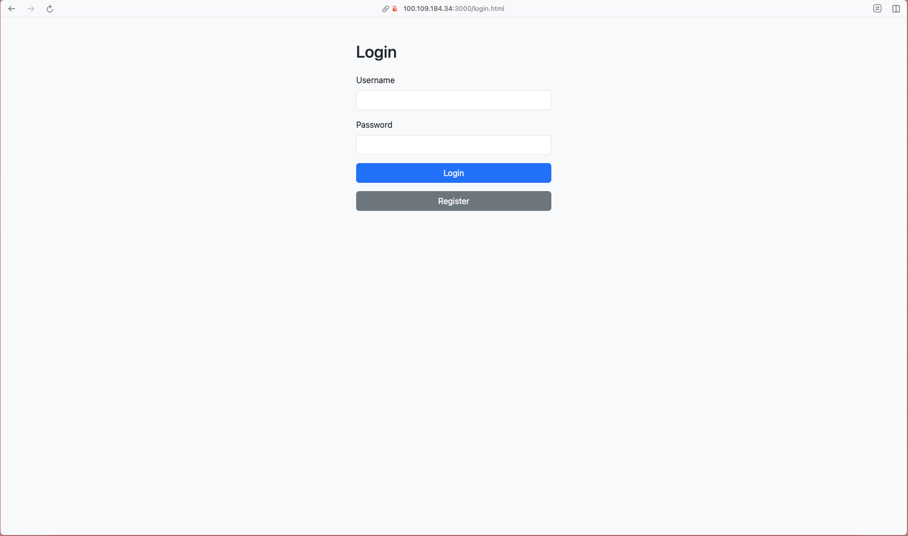
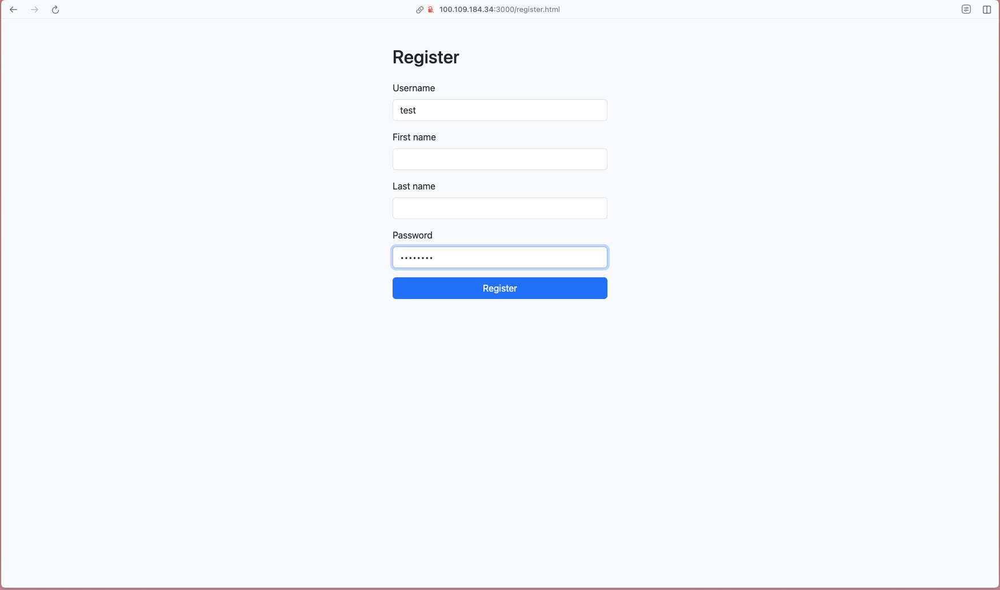
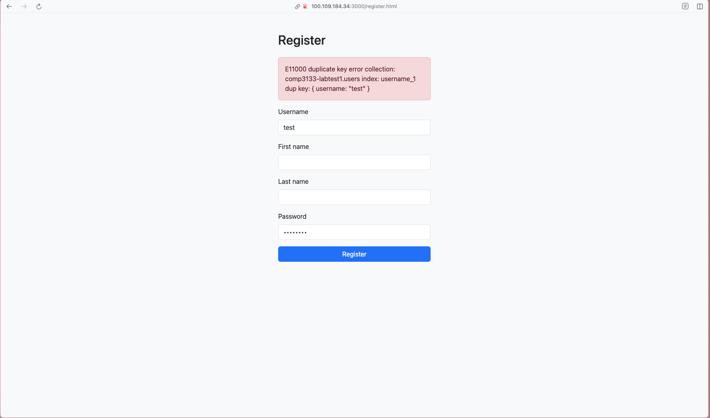
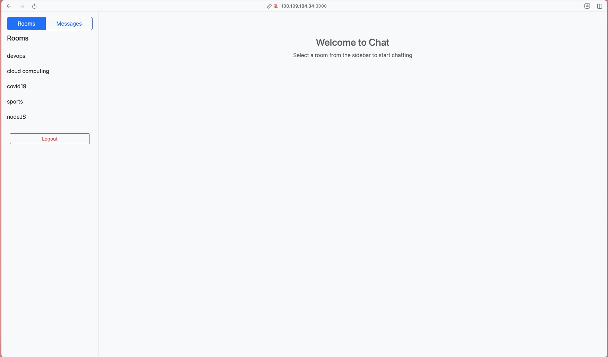
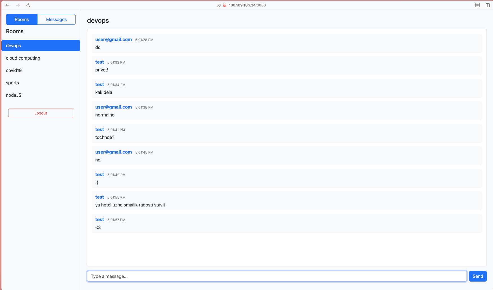
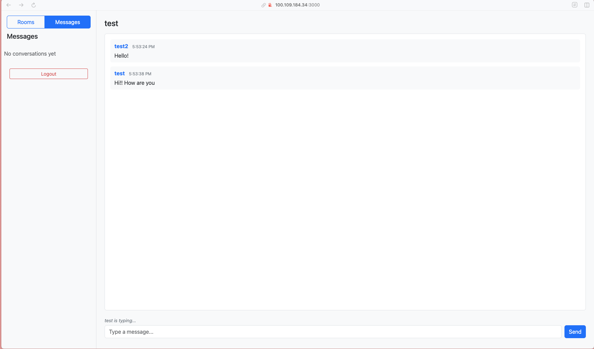

# 101480050_lab_test1_chat_app
## by Eduard Kosenko, 101480050
### Technology used
FrontEnd:
* HTML
* CSS
* Jquery

Backend:
* Node.js + Express.js
* Mongoose + MongoDB
* socket.io

Auth:
* JWT + LocalStorage

### Setup
1. npm install
2. populate .env
3. node index.js

### Showcase
Login

Registration

Validation

Homepage

Open Room

Open Direct message with typeing indicator
